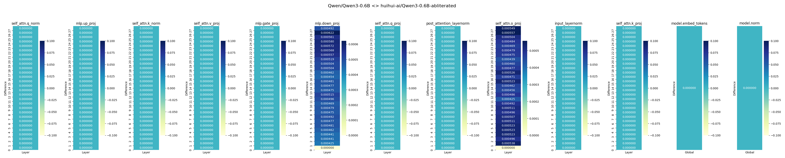

# Model Weight Comparison

This project provides a Python script (`compare_models.py`) to compare the weights of two transformer models using the Hugging Face Transformers library. It calculates the mean absolute differences between corresponding weights, supports top-level parameters (e.g., `embed_tokens`, `norm`) and layer parameters, and visualizes the results with heatmaps. The script includes a progress bar, automatic label extraction, and command-line argument support.

## Features
- **Weight Comparison**: Computes mean absolute differences between weights of two transformer models.
- **Top-Level and Layer Parameters**: Compares both top-level parameters (e.g., `embed_tokens`) and layer-specific parameters (e.g., `input_layernorm`, `mlp.down_proj`).
- **Visualization**: Generates heatmaps for layer and global weight differences, with customizable narrow bars and border padding.
- **Progress Bar**: Displays progress during layer comparison using `tqdm`.
- **Automatic Label Extraction**: Extracts weight component names and removes `.weight` suffixes for cleaner labels.
- **Command-Line Interface**: Supports `--model1`, `--model2`, and `--plot` arguments for flexible usage.

## Prerequisites
- Python 3.6 or higher
- Git (for cloning the repository)

## Installation
1. **Clone the Repository**:
   ```bash
   git clone https://github.com/yourusername/model-comparison.git
   cd model-comparison
   
## install Dependencies:
```bash
pip install transformers torch matplotlib seaborn tqdm
```
## Run the Script:
```bash
python compare_models.py -model1 "Qwen/Qwen3-0.6B" --model2 "huihui-ai/Qwen3-0.6B-abliterated" --plot
```
Compares weights of Qwen/Qwen3-0.6B and huihui-ai/Qwen3-0.6B-abliterated.
--plot enables visualization, generating heatmaps saved as a PNG (e.g., ).
